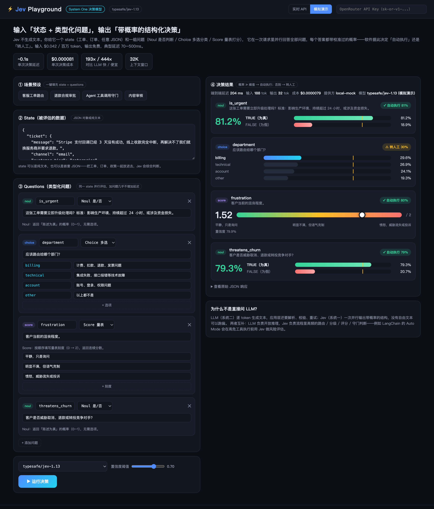

# Jev Playground · System One 决策模型可视化演示

[Jev](https://openrouter.ai/typesafe/jev-1.13)（TypeSafe AI 的首个 System One 模型）的可视化演示界面。Jev 不生成文本：你给它一个 **state**（工单、订单、任意 JSON）和一组**类型化问题**，它在一次请求里并行回答全部问题，每个答案都带校准过的概率——软件据此决定「自动执行」还是「转人工」。



> 截图演示的是「客服工单路由」预设：一次请求并行评估 4 个问题——紧急度（Noul 81.2%）、部门路由（Choice 概率分布）、客户沮丧程度（Score 1.52/2）、流失威胁（Noul 79.3%），并按置信度阈值自动标注「自动执行 / 转人工」。

## 功能

- **三种问题类型**：`Noul`（是/否 → 概率双色条）、`Choice`（多选 → 各选项概率分布）、`Score`（量表 → 刻度游标 + 置信度）
- **并行提问**：同一 state 一次请求问多个问题，对应 Jev「加问题几乎不增加延迟」的特点
- **置信度阈值**：拖动滑块，每个答案实时切换「自动执行 / 转人工」——Jev 校准概率（RLCD）的核心用法
- **四个场景预设**：客服工单路由、退款合规审批、Agent 工具调用守门、内容审核
- **实时指标**：端到端延迟、输入/输出 token、成本、提供方，附原始 JSON 响应
- **双模式**：「实时 API」走真实模型；「模拟演示」用本地生成的示意数据，无 key 也能完整体验界面

## 快速开始

```bash
python3 server.py          # 默认端口 8787，无第三方依赖
open http://localhost:8787
```

- **实时 API**：在页面右上角粘贴 OpenRouter API Key（仅保存在浏览器 localStorage），或启动时传入：
  ```bash
  OPENROUTER_API_KEY=sk-or-v1-... python3 server.py
  ```
  在 [openrouter.ai/settings/keys](https://openrouter.ai/settings/keys) 获取 key。
- **模拟演示**：页面右上角切换到「模拟演示」，无需 key。
- **自动运行**：打开 `http://localhost:8787/#mockrun` 会在加载后自动以模拟模式运行一次（本 README 的截图即由此生成）。

## 技术说明

Jev 是决策模型而非文本模型，OpenRouter 在专用端点提供服务（不能走 `/chat/completions`）：

```
POST https://openrouter.ai/api/alpha/decisions
Authorization: Bearer <OPENROUTER_API_KEY>

{"model": "typesafe/jev-1.13", "state": {...}, "questions": {...}}
```

`server.py` 作为本地代理转发该端点（避免浏览器 CORS，key 不落地到 HTML 文件）。页面直接访问时需经 `server.py` 打开，而非双击 HTML。

模型定价：输入 $0.042 / 百万 token，输出免费；典型延迟 70–500ms；上下文 32K。

## 文件

| 文件 | 说明 |
| --- | --- |
| `index.html` | 演示界面（单文件，深色科技风） |
| `server.py` | 本地服务：静态托管 + Decisions API 代理 + 模拟模式（仅标准库） |
| `screenshot.png` | 界面截图（`#mockrun` 模式下无头 Chrome 生成） |
